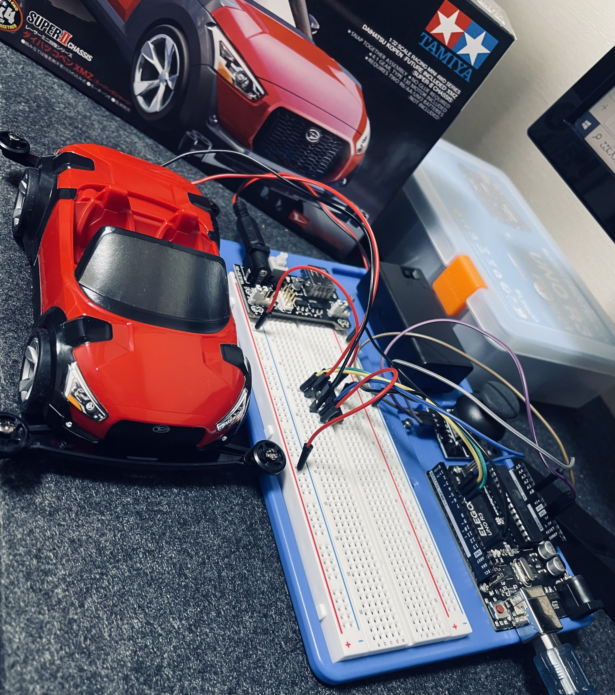
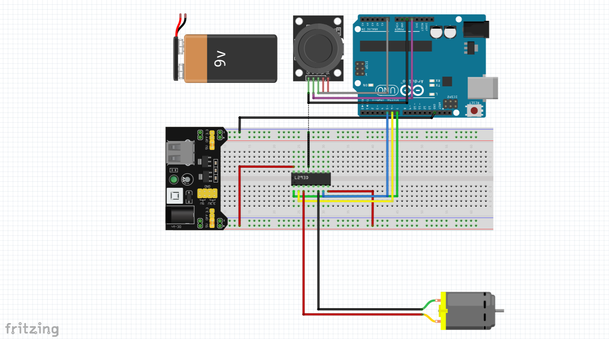

# Arduinoでリモコンカーを作ってみる

C言語の学習を進める中で、実際に自分で手を動かして何か作ってみたいと思い、Arduinoを使ってリモコンカー(通称ヒモコン)を作ってみました。

Arduino言語はC/C++をベースとしているため、変数の扱いや制御構文などC言語の基礎を学ぶのに役に立ち、ほんの少しでもハードウェア制御の勉強にもなるかなと思い、Arduinoを使いました。

## 回路図

回路図はFritzingで作成しました。

## 作成にあたり、参考にさせていただいたサイト
- とりあえずメカのりまき様
https://mecha-norimaki.com/
- DIY電子工作様
https://diy-electronics-beginners.net/category/learning/

## ギミック
ジョイステックで前進・後退を操作できます。

## 開発環境
- OS：Windows10
- 言語：Arduino言語
- IDE：Arduino IDE

## 使用した物
- ELEGOO Arduino用UNO R3スターターキット
- タミヤ(TAMIYA) レーサーミニ四駆シリーズ No.82 ダイハツ コペン XMZ スーパーIIシャーシ
- 9V電池ボックス
- ABSベースプレート
- ジャンパーワイヤー(追加分)
